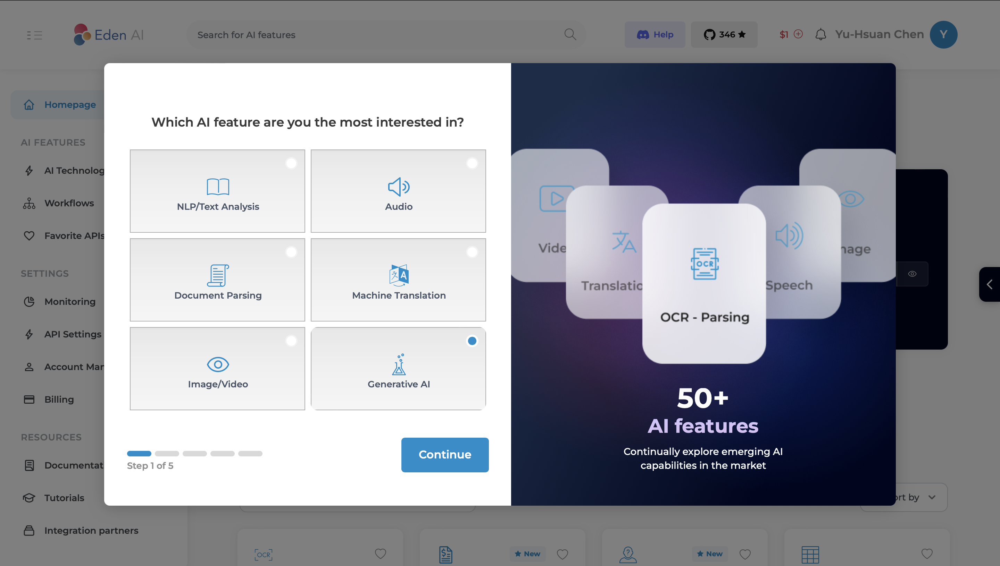

# Lab 05 OpenAI APIs (EdenAI)

Today's lab will be **directly evaluated** by teaching assistants, so **only a 100-point version** will be available, **not a 60-point version**.

We will utilize EdenAI as an example to demonstrate how to leverage existing AI generation providers and their APIs to meet requirements and retrieve generated content. (Alternatively, you may explore other APIs capable of producing images from text, but **you will be responsible for covering the associated costs**.)

# Description

1. Create an account on EdenAI.
   

2. Once you've filled in the necessary details, you'll be directed to the main screen.
   
   
   
   
   

3. On the left-hand side, choose AI Technologies > Generative .
   
   

4. From the options presented, select Image Generation.
   

5. In the middle of the screen, you'll find a sample program.
   

EdenAI collaborates with various providers for image generation, each offering different pricing structures.
   
Given the **quota of only one US dollar**, it is advisable to select a provider with **lower costs (e.g., Replicate)**.
   

# Grading
You can employ Flutter to exhibit an image generated after processing text through the API. **(100%)**  

Example of results:
Enter phone（or other prompt) and press Generate Image to display the image below.
   
   
   

## Deadline
Ensure your work is directly evaluated by teaching assistants before 2024/03/28 (Thur.) 17:20:00.

The score you have done will be 100%.

# Resources
- [EdenAI](https://www.edenai.co)

